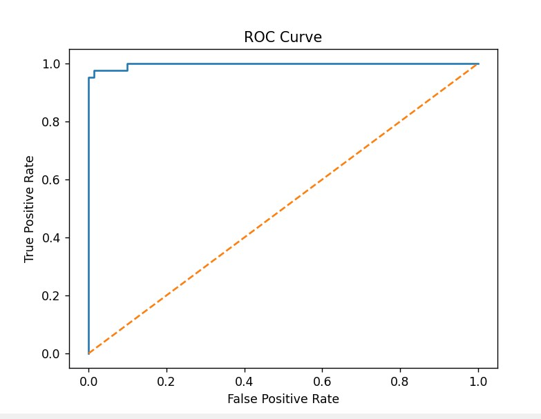

# Classification with Logistic Regression

## 📌 Objective
The objective of this project is to build a binary classification model using Logistic Regression to classify tumors as malignant (cancerous) or benign (non-cancerous).

---

## 🛠 Tools & Technologies Used
- Python
- Pandas
- NumPy
- Scikit-learn
- Matplotlib

---

## 📂 Dataset
- Breast Cancer Wisconsin (Diagnostic) Dataset
- Contains features extracted from digitized images of breast mass

---

## ⚙️ Steps Performed
1. Loaded dataset using Pandas
2. Removed unnecessary columns (id, empty columns)
3. Converted diagnosis column:
   - M (Malignant) → 1
   - B (Benign) → 0
4. Handled missing values
5. Standardized features using StandardScaler
6. Split data into training and testing sets
7. Trained Logistic Regression model
8. Predicted outcomes
9. Evaluated model using:
   - Confusion Matrix
   - Precision
   - Recall
   - ROC-AUC
10. Plotted ROC Curve

---

## 📊 Results
- Precision: 0.98
- Recall: 0.95
- ROC-AUC: 1.0

---

## 🧠 Interpretation
The model performs extremely well with high precision and recall. The ROC-AUC score of 1.0 indicates near-perfect classification capability.

---

## 📈 Output

### ROC Curve


---

## 🚀 How to Run

1. Install required libraries:
```bash
pip install pandas numpy matplotlib scikit-learn
